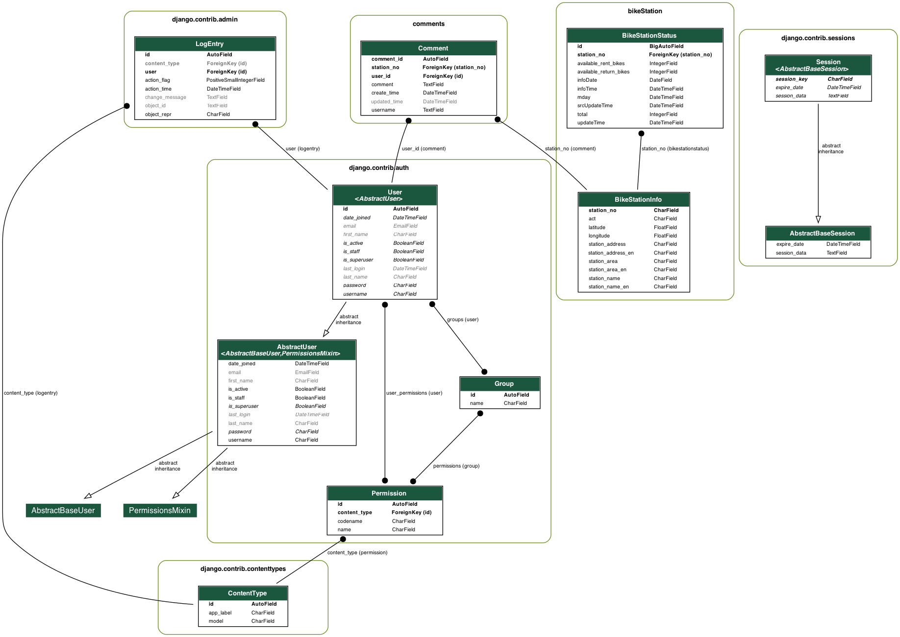

<pre>
1. A database schema that is suitable for recording the data that is provided with proper relationships and normalized form.In addition, a simple user management database schema, which allows a user to leave a comment about each YouBike site. 
    Database : sqllite  
        user management database : django.contrib.auth.models  

<pre/>

2. A script that scrapes and records this data into the database every minute.  
    script :  
    
        bikeStation/management/commands/fetch_bike_station_info.py  
        bikeStation/management/commands/fetch_bike_station_status.py  
    cmd: ( can build a cron job in django)  
        python manage.py fetch_bike_station_info 'https://tcgbusfs.blob.core.windows.net/dotapp/youbike/v2/youbike_immediate.json'  
        python manage.py fetch_bike_station_status 'https://tcgbusfs.blob.core.windows.net/dotapp/youbike/v2/youbike_immediate.json'  
  
3. A RESTful API that provides the following functions:  
    a. RESTful methods for user registration, login, and logout.  
    
  script :  
    users/urls.py  
  path:  
    path('login/', login_view, name='login'),  
    path('register/', register_view, name='register'),  
    path('logout/', logout_view, name='logout'),  
  
    
b. RESTful methods for users to add, update, delete comments about a YouBike  
site.
    
  script:  
    comments/urls.pyv
  path:  
      path('list_comment', comment_view, name='comment_view'),  
      path('add_comment/', add_comment, name='add_comment'),  
      path('edit/<int:comment_id>/', edit_comment, name='edit_comment'),  
      path('delete/<int:comment_id>/', delete_comment, name='delete_comment'),  

c. A GET method that returns sites sorted by sites with the most comments at the  
top, with pagination.  
  script:  
    comments/urls.py  
  path:  
    path('data/most-commented-stations-data/', most_commented_stations, name='most_commented_stations_data'),  
  
 
d. A GET method that returns similar data as the json with:  
i. A site name search parameter that can search both english or chinese  
ii. An area filter parameter to filter by keywords  
    script:  
      bikeStation/urls.py  
    path:v
      path('search/', search_stations, name='search_stations')  
  
e. A GET method that returns sites that have no bikes.  
    script:  
      bikeStation/urls.py  
    path:  
      path('data/stations_with_no_bikes_data/', stations_with_no_bikes, name='stations_with_no_bikes')  
      
5. [Optional] Unit test  
